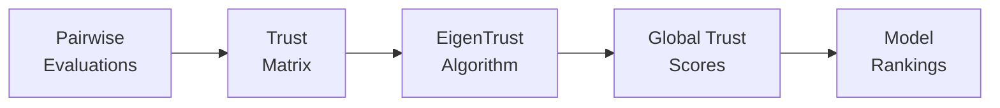

EigenBench is a decentralized evaluation framework that measures AI model alignment by having models evaluate each other according to specific value systems (constitutions). Instead of relying on human judges or a single authority, EigenBench builds a trust network from peer evaluations.

## How it works

EigenBench operates on a simple principle: models judge each other's responses to scenarios based on shared criteria, and we learn which models are trusted by analyzing the pattern of evaluations.

<Steps>
  <Step title="Models respond to scenarios">
    Each model generates responses to real-world scenarios without knowing they'll be evaluated.
  </Step>
  
  <Step title="Models judge each other">
    Models act as judges, comparing pairs of responses according to constitutional criteria.
  </Step>
  
  <Step title="Build trust matrix">
    Evaluations are aggregated into a trust matrix that captures which models trust which others.
  </Step>
  
  <Step title="Compute global trust">
    The EigenTrust algorithm computes global trust scores from the trust matrix.
  </Step>
</Steps>

## Key concepts

<CardGroup cols={2}>
  <Card title="Constitutions" icon="scroll" href="/concepts/constitutions">
    Value systems that define evaluation criteria
  </Card>
  
  <Card title="Pipeline" icon="diagram-project" href="/concepts/pipeline">
    Three-stage process: collect, evaluate, train
  </Card>
  
  <Card title="Trust matrix" icon="table-cells" href="/concepts/eigentrust">
    Captures pairwise trust between models
  </Card>
  
  <Card title="EigenTrust" icon="network-wired" href="/concepts/eigentrust">
    Algorithm for computing global trust scores
  </Card>
</CardGroup>

## Why peer evaluation?

Traditional benchmarks rely on human labeling or gold-standard answers. EigenBench takes a different approach:

<AccordionGroup>
  <Accordion title="Scalability">
    Having models evaluate each other is vastly more scalable than human evaluation. You can collect thousands of evaluations in hours rather than weeks.
  </Accordion>
  
  <Accordion title="Diverse perspectives">
    Different models have different tendencies and biases. By aggregating evaluations from multiple judges, we get a more robust signal than from any single evaluator.
  </Accordion>
  
  <Accordion title="Value alignment">
    By using constitutional criteria, we can measure alignment with specific value systems (kindness, safety, helpfulness, etc.) rather than generic "quality."
  </Accordion>
  
  <Accordion title="Self-consistency">
    The trust network reveals which models are consistent judges and which models' outputs are consistently preferred by the network.
  </Accordion>
</AccordionGroup>

## From evaluations to rankings

EigenBench doesn't just collect opinions—it synthesizes them into meaningful rankings:

The trust matrix captures local preferences (model i prefers model j over model k), while EigenTrust computes global trust scores that reflect the entire network's consensus.

<Info>
EigenTrust is borrowed from peer-to-peer networks, where it was used to identify trustworthy nodes. In EigenBench, we apply it to identify models whose outputs are trusted by the network.
</Info>

## Matrix factorization approach

Under the hood, EigenBench uses Bradley-Terry-Davidson (BTD) models to learn latent representations:

- **Judge embeddings (U)**: Capture each model's evaluation tendencies
- **Evaluee embeddings (V)**: Capture each model's response characteristics
- **Trust scores**: Computed as similarity between judge and evaluee embeddings

This approach allows EigenBench to:
- Handle missing comparisons (not every judge evaluates every pair)
- Model ties and near-ties explicitly
- Generalize to new scenarios

<Note>
The trust matrix S is computed as S = exp(U @ V^T), where U and V are learned from the evaluation data.
</Note>

## Next steps

<CardGroup cols={2}>
  <Card title="Pipeline" icon="diagram-project" href="/concepts/pipeline">
    Understand the three-stage pipeline
  </Card>
  
  <Card title="Constitutions" icon="scroll" href="/concepts/constitutions">
    Learn about value systems and criteria
  </Card>
  
  <Card title="Quickstart" icon="rocket" href="/quickstart">
    Run your first evaluation
  </Card>
  
  <Card title="API Reference" icon="code" href="/api/eval/collect">
    Explore the API
  </Card>
</CardGroup>
